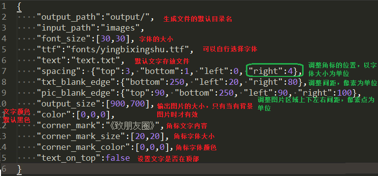

## 软件配置

1. 在使用之前在软件目录下建立一个 text.txt（默认）， 将准备好的文字放进去。注意：每段文字都以空一行进行分割，一段文字会被用于合成到一个图片且不重复。

2. 打开隐藏文件夹 .config 找到Default-config.json并进行配置

   

## 使用方法
	make_pic.exe [options] <image path>
	Draw the text on give image.
	Options:
	--version             show program's version number and exit
	-h, --help            show this help message and exit
	-u, --update          update image database
	-d, --reset-to-default
	                      restart database to default
	-n NUMBER, --number=NUMBER
	                      Input the number of images

1. 如果是第一次使用，使用下面命令进行数据库的更新。注意：图片文件件有新添加的文件时同样需要运行，更新数据库。
  `make_pic.exe -u <image path>`

2. 更新完数据库后就可以使用下面命令生成图片了。

  `make_pic.exe -n <count> <image path>`

  新图片的生成会在 output 目录下，每个子目录以“日期-当天执行次数-生成图片个数”命名。
